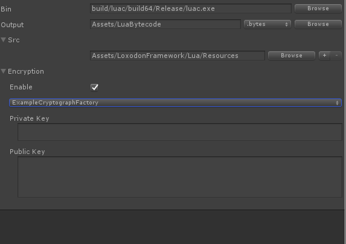

# Loxodon Framework XLua

**要求Unity 5.6.0或者更高版本**

Loxodon.Framework框架的XLua插件，它是一个lua的MVVM框架，支持lua和c#混合编程或者也可以完全使用lua来编写您的整个游戏。

## 要求 ##

[Loxodon Framework](https://github.com/cocowolf/loxodon-framework)

本项目作为Loxodon.Framework插件，必须在Loxodon.Framework环境下使用，请在安装使用前先安装Loxodon.Framework框架。

## Quick start ##

1. You can download the latest version of xlua from Xlua's Github repository,the file name is usually xlua_v2.x.xx.zip, unzip and copy it to your project.(XLua Download:https://github.com/Tencent/xLua/releases)

2. Configure a macro definition called "XLUA" in PlayerSetting/Scripting Defin Symbols.It is recommended to configure all platforms.

3. Find Loxodon.Framework.XLua.unitypackage in the LoxodonFramework/Docs/XLua directory and import it into the project.

4. Please see the example in the LoxodonFramework/Lua/Examples directory to enjoy your lua tour.

## 导入教程 ##

1. 从Xlua的Github仓库下载最新版的XLua，可以使用源码版本Source code.zip或者xlua_v2.x.xx.zip版本（建议使用xlua_v2.x.xx.zip版本，避免命XLua目录下测试类导致的类名冲突）。将下载好的xlua解压缩，拷贝到项目中。

2. 配置Unity3D项目PlayerSetting/Scripting Defin Symbols，添加XLUA的宏定义，为避免出错，最好将PC、Android、iOS等平台的都配上。

3. 导入LoxodonFramework目录下Docs/XLua/Loxodon.Framework.XLua.unitypackage。如果出现编译错误，请检查是否导入了XLua的Examples目录，这个目录下的InvokeLua.cs文件定义了PropertyChangedEventArgs类，因没有使用命名空间，会导致和System.ComponentModel.PropertyChangedEventArgs类冲突，请删除XLua目录下的Examples文件夹或者给InvokeLua.cs文件中的PropertyChangedEventArgs类添加上命名空间。

4. 打开LoxodonFramework/Lua/Examples 目录，查看示例。

## Lua 预编译工具 ##

使用Lua预编译工具可以将Lua脚本预编译为字节码文件，并且可以选择是否加密该文件。Lua官方的luac命令编译的字节码分64位和32位，如果想编译64位和32位兼容的字节码，请参考XLua的官方文件，有关通用字节码编译的部分[《通用字节码》](https://github.com/Tencent/xLua/blob/master/Assets/XLua/Doc/compatible_bytecode.md)。

- Bin:luac命令的路径，如果要编译64位或者32位或者两者相兼容的字节码，请选择对应的luac命令。
- Output：编译后的字节码文件的存储目录。可以选择Assets下面的某个目录，统一打包为一个AssetBundle，也可以选择StreamingAssets下的某个目录，直接从StreamingAssets文件夹中加载。预编译后的字节码文件的扩展名可以选择".luac"或者".bytes"，也可以自定义其他的扩展名。
- Src：lua源代码的根目录，支持多个源代码目录。源代码文件扩展名必须是".lua"或者".lua.txt"。
- Encryption：加密功能，默认支持AES加密方式，也可以自己扩展新的加密方式，加密部分的面板是动态的，扩展了新的加密方式，会自动显示在工具的界面中。
- Apply：保存设置
- Precompile：预编译Lua脚本

### Lua加载器 ###

- FileLoader 文件加载
    
    文件加载器，支持从本地文件夹加载Lua脚本或者Lua字节码文件，同时也支持从Android的apk或者obb中加载文件，所以如果你的lua源代码或者字节码文件存放在StreamingAssets文件夹中，在Android平台也能够正确加载。
    
- AssetBundleLoader 加载器
    
    支持从AssetBundle中加载lua脚本或者字节码，一般来说建议将所有的lua字节码都放在同一个AssetBundle中，在游戏启动时加载到内存，配置AssetBundleLoader加载器，优先从这个AssetBundle中加载lua代码。

- DecodableLoader 可解码的加载器

    可解码的加载器，它配合文件加载器或者AssetBundle加载器一起使用，对二进制数据进行解密。

### 示例 ###

在下面的示例中，在Editor模式，通过FileLoader从Assets/LuaScripts/目录中加载扩展名为".lua.txt"或者".lua"的lua文件。在真机模式，则通过FileLoader从Application.persistentDataPath + "/LuaScripts/"目录加载lua字节码文件，如果没有找到则搜索Application.streamingAssetsPath + "/LuaScripts/"目录，并且使用DecodableLoader加载器进行解密。

**在LuaEnv中可以添加多个加载器，后加入的加载器优先级高于先加入的加载器。**

    var luaEnv = LuaEnvironment.LuaEnv;

    #if UNITY_EDITOR
        //开发模式，从本地目录加载lua源码
        luaEnv.AddLoader(new FileLoader(Application.dataPath + "/LuaScripts/", ".lua"));
        luaEnv.AddLoader(new FileLoader(Application.dataPath + "/LuaScripts/", ".lua.txt"));
    #else
        //真机模式，从persistentDataPath或者streamingAssetsPath目录加载lua的bytecode.
        var key = Encoding.ASCII.GetBytes("E4YZgiGQ0aqe5LEJ");
        var iv = Encoding.ASCII.GetBytes("5Hh2390dQlVh0AqC");
        var decryptor = new RijndaelCryptograph(128,key, iv);
        
        var loader1 = new FileLoader(Application.streamingAssetsPath + "/LuaScripts/", ".bytes");
        luaEnv.AddLoader(new DecodableLoader(loader1, decryptor));
        
        var loader2 = new FileLoader(Application.persistentDataPath + "/LuaScripts/", ".bytes");
        luaEnv.AddLoader(new DecodableLoader(loader2, decryptor));
    #endif
    
### 扩展其他加密方式 ###

继承Loxodon.Framework.Security.Cryptography.IDecryptor和Loxodon.Framework.Security.Cryptography.IEncryptor接口创建加密解密器，具体实现可以参考RijndaelCryptograph类的源代码。 

继承Loxodon.Framework.XLua.Editors.EncryptorFactory类可以为新的加密器创建一个工厂类，将加密需要的参数作为类的成员变量定义在类中，并标识字段为可序列化，即添加"SerializeField"属性。，这样预编译工具可以自动搜索到这个类，并为它创建一个编辑界面。具体实现请参考RijndaelCryptographFactory类。

比如添加如下代码，则可以在编辑界面看到如图中所示的界面

    public class ExampleCryptographFactory : EncryptorFactory
    {
        [Multiline(2)]
        [SerializeField]
        private string privateKey;

        [Multiline(5)]
        [SerializeField]
        private string publicKey;

        public override IEncryptor Create()
        {
            throw new NotImplementedException();
        }
    }
    

## 联系方式
邮箱: [yangpc.china@gmail.com](mailto:yangpc.china@gmail.com)   
网站: [https://cocowolf.github.io/loxodon-framework/](https://cocowolf.github.io/loxodon-framework/)  
QQ群: 622321589 
